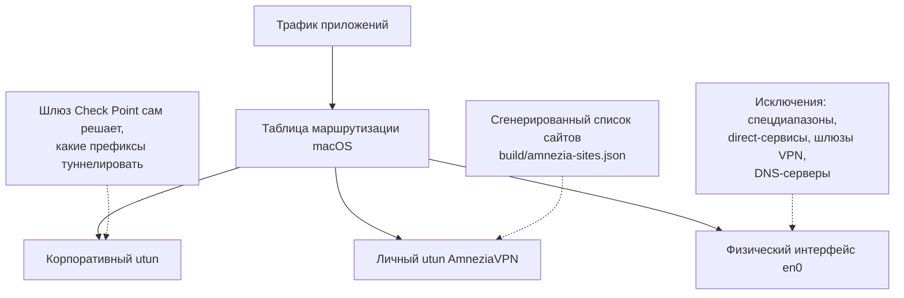

# comrades-tunnel

Две VPN одновременно на macOS: корпоративный **Check Point Endpoint Security
VPN** — для корпоративных ресурсов, и личный **AmneziaVPN** (WireGuard /
AmneziaWG) — для всего остального интернета. Разбиение трафика между ними
детерминированное и полностью регенерируемое: корпоративные сети → в
корпоративный туннель; отдельные "прямые" сервисы (российские сервисы,
которые ведут себя плохо при выходе через зарубежный IP) → напрямую через
физический интерфейс; всё остальное → в личный VPN.

## Как это работает

1. Корпоративный клиент Check Point сам поднимает префиксы своего
   encryption domain в собственный `utun` и оставляет маршрут по умолчанию
   на физическом интерфейсе. Клиенту не нужна никакая настройка с нашей
   стороны, и его нельзя попросить туннелировать что-то ещё — какие сети
   туннелировать, решает только шлюз на стороне компании.
2. Split DNS для корпоративных зон через файлы `/etc/resolver/<zone>`,
   указывающие на корпоративные DNS-серверы, доступные только через
   корпоративный туннель (с `timeout 3`, чтобы резолвинг быстро падал, если
   туннель не поднят). Эти файлы переживают любой VPN-клиент, который
   перезаписывает системный DNS.
3. AmneziaVPN держится в режиме "только выбранные сайты" (режим "кроме
   выбранных сайтов" в клиенте содержит открытые баги на macOS), а сам
   список сайтов **генерируется** как дополнение всего IPv4-пространства
   минус исключения. Longest-prefix-match в таблице маршрутизации оставляет
   корпоративные префиксы в корпоративном туннеле, даже если адресное
   пространство RFC 1918 целиком исключено из списка личного VPN.



DNS устроен отдельно от маршрутизации трафика: запрос к корпоративной зоне
уходит через `/etc/resolver/<zone>` на корпоративный DNS-сервер, доступный
только через корпоративный туннель; запрос к любому другому имени идёт через
обычный системный резолвер как обычно.

## DNS: клиент Check Point переписывает DNS Wi-Fi

При подключении корпоративный клиент Check Point Endpoint Security VPN сам
переписывает DNS-серверы основного сетевого сервиса (Wi-Fi) на слое Setup —
том же слое, что System Settings и `networksetup -setdnsservers`: он
дописывает в начало списка корпоративные DNS-серверы и свои search domains,
оставляя DHCP-серверы позади них.
Что бы ни стояло там раньше (например, DNS личного VPN), оно теряется.

Следствие: пока корпоративный DNS стоит первым в списке, часть публичных
имён не резолвится — например, видеохостинги фильтруются корпоративной DNS.
Ручная правка (`networksetup -setdnsservers Wi-Fi ...`) не помогает: клиент
переписывает тот же слой при каждом переподключении, так что изменение живёт
только до следующего reconnect.

Split-DNS для корпоративных зон через `/etc/resolver/<zone>` (см. выше)
работает независимо от системного списка DNS-серверов, поэтому убрать
корпоративные серверы из этого списка ничего не ломает.

`bin/dns-guard.sh`, установленный `bin/install-dns-guard.sh` как
LaunchDaemon, следит за
`/Library/Preferences/SystemConfiguration/preferences.plist` и
`/private/var/run/resolv.conf` (плюс запуск при загрузке) и восстанавливает
желаемый список DNS-серверов, не трогая search domains. Два режима:
`corp-only` (по умолчанию) — вмешивается только когда в текущем списке
обнаружен один из корпоративных DNS-серверов; `always` — приводит список к
заданным серверам при любом расхождении.

Установка (сначала dry-run, затем применить):

```
sh bin/install-dns-guard.sh
sudo sh bin/install-dns-guard.sh --apply
```

Удаление:

```
sudo sh bin/install-dns-guard.sh --uninstall
```

`--apply` и `--uninstall` требуют `sudo`: скрипт и конфиг копируются в
`/Library/Application Support/comrades-tunnel/` от root, LaunchDaemon ставится
в `/Library/LaunchDaemons/`. Копия root-owned намеренно: демон исполняет её от
root при каждом срабатывании, и если бы вместо этого он запускал файл прямо
из домашней директории пользователя, это была бы дыра для повышения
привилегий — что угодно, способное писать в эту директорию, могло бы
подменить код, который затем выполнится от root.

Установщик отказывается ставить скрипт в директорию, чей какой-либо
предок доступен на запись непривилегированному пользователю (и потому
позволяет ему подменить исполняемый демоном файл) — например, не ставит в
`/usr/local/...`, где Homebrew делает директории доступными пользователю на
запись. `--apply` перед установкой проверяет всю цепочку предков и выходит с
ошибкой, если какой-то из них не принадлежит root или имеет права на запись;
`--dry-run` просто показывает такой отчёт (`ok:` / `UNSAFE:`).

Логи: `/var/log/comrades-tunnel-dns-guard.log`. Проверка после
переподключения корпоративного VPN:

```
networksetup -getdnsservers Wi-Fi
tail /var/log/comrades-tunnel-dns-guard.log
```

## Что никогда не попадает в личный VPN

Список исключений, из которого генератор (`bin/gen-amnezia-sites.py`) строит
дополнение:

- специальные/приватные диапазоны IPv4 — `0.0.0.0/8`, `10.0.0.0/8`,
  `100.64.0.0/10`, `127.0.0.0/8`, `169.254.0.0/16`, `172.16.0.0/12`,
  `192.0.0.0/24`, `192.0.2.0/24`, `192.168.0.0/16`, `198.18.0.0/15`,
  `198.51.100.0/24`, `203.0.113.0/24`, `224.0.0.0/4`, `240.0.0.0/4`;
- `direct-cidrs.txt` — IP-адреса шлюзов корпоративного VPN (как `/32`) и
  публичные корпоративные подсети (найденные через whois);
- резолвленные IP-адреса хостов из `corp-hosts-check.txt`;
- DNS-серверы, выданные по DHCP на основном интерфейсе, плюс любые лишние IP
  из `direct-dns.txt` (например, офисный резолвер на сети, где DHCP его не
  выдаёт);
- `direct-domains.txt`, расширённый до целых автономных систем через
  RIPEstat, когда это безопасно: ASN зарегистрирован как RU в делегированном
  файле RIPE NCC
  (`https://ftp.ripe.net/pub/stats/ripencc/delegated-ripencc-extended-latest`)
  и анонсирует не больше 200 префиксов IPv4 — иначе исключаются только
  резолвленные `/32`.

Почему именно так: IP-адреса CDN меняются со временем, поэтому просто
резолвить домен раз и навсегда недостаточно — но исключать целиком
иностранное облако вроде Cloudflare было бы неправильно, а исключать целиком
крупного российского провайдера вроде "Ростелекома" с тысячами префиксов
раздувает список до неприемлемого размера. Отсюда правило: расширяем до
целой ASN только когда она зарегистрирована в России и анонсирует
ограниченное число префиксов.

Для отдельных строк `direct-domains.txt` поведение можно переопределить
токеном после домена: `<домен> asn` — принудительно расширить до всей ASN
вне зависимости от страны/лимита, `<домен> ip` — расширять только
резолвленными `/32`.

Результаты запросов к RIPEstat и файл RIPE NCC кэшируются в `build/cache/`
на 7 дней. `--refresh` заставляет перекачать кэш заново, `--no-asn`
полностью отключает расширение до ASN (только резолвленные `/32`, как
раньше).

### Почему не "все российские сети"

Исключить из личного VPN вообще все сети, зарегистрированные в России, можно
было бы взять напрямую из делегированного файла RIPE NCC — но это ~21 700
записей, и AmneziaVPN устанавливает маршруты по одному. С пресетом из 28
популярных сервисов (`config/presets/direct-domains.ru-popular.txt`)
итоговый список — около 2 200 сетей, что на порядок меньше и не создаёт
проблем клиенту при импорте и подключении.

### Компромисс: размер списка сайтов vs скорость подключения корпоративного VPN

Каждая сеть из `amnezia-sites.txt` после импорта в AmneziaVPN — это
отдельный маршрут в таблице маршрутизации macOS. При подключении
корпоративный клиент Check Point сверяет свои собственные маршруты с
каждым уже существующим маршрутом в таблице, и эта сверка резко
замедляется, когда маршрутов тысячи: с полным списком (~2200 сетей)
подключение занимает 2–5 минут вместо нескольких секунд.

`--max-sites N` у `bin/gen-amnezia-sites.py` ужимает список: сортирует
промежутки между исключениями по размеру и жадно сливает САМЫЕ МАЛЕНЬКИЕ
из них с соседними исключениями, пока итог не уложится в N сетей.
Слияние только добавляет адреса в исключения, поэтому всё, что обязано
идти в обход личного VPN, идёт в обход и после сжатия — но платой служит
то, что чуть больше адресного пространства, чем строго необходимо, тоже
уходит в обход напрямую, а не через личный VPN.

`make sites-small` генерирует список с бюджетом 400 сетей по умолчанию
(`MAX_SITES=N` переопределяет), `MAX_SITES=N make sites` — тот же приём
для обычной генерации.

Слияние промежутков размер-приоритетно и ничего не знает о важности адреса —
поэтому `local/keep-tunneled.txt` фиксирует IP/CIDR, которые обязаны остаться
в личном VPN при любом бюджете: промежуток, который их содержит, никогда не
сливается, даже если он самый маленький. По умолчанию туда занесены
публичные DNS-резолверы (`1.1.1.1`, `8.8.8.8` и т.д.) — личный VPN несёт весь
DNS-трафик, и потеря резолвера меняет поведение резолвинга имён. Если при
заданном `--max-sites` все оставшиеся промежутки защищены и бюджет
недостижим, генератор печатает WARNING и оставляет список как есть, а не
жертвует защищёнными адресами ради бюджета.

## Быстрый старт

Предварительные требования: macOS, подключённый клиент Check Point Endpoint
Security VPN, десктопное приложение AmneziaVPN 4.8+ с сервером
WireGuard/AmneziaWG, `python3`, `git`.

1. Скопируйте шаблон конфигурации и отредактируйте каждый файл:

   ```
   cp -r config/example local
   ```

   - `local/corp-domains.txt` — корпоративные DNS-зоны (по одной на строку),
     для которых будет создан `/etc/resolver/<zone>`.
   - `local/corp-dns.txt` — IP-адреса корпоративных DNS-серверов, доступных
     через корпоративный туннель.
   - `local/corp-dns-options.txt` — дополнительные опции resolver(5),
     дописываемые после строк `nameserver` (например, `timeout 3`).
   - `local/direct-cidrs.txt` — CIDR-блоки шлюзов корпоративного VPN (как
     `/32`) и публичные корпоративные подсети.
   - `local/direct-dns.txt` — дополнительные DNS-серверы (по одной IP на
     строку), которые должны всегда идти напрямую сверх выданных по DHCP.
   - `local/direct-domains.txt` — домены, которые должны идти напрямую.
     Удобнее всего скопировать готовый пресет:
     `cp config/presets/direct-domains.ru-popular.txt local/direct-domains.txt`
     и отредактировать под себя.
   - `local/corp-hosts-check.txt` — известные корпоративные хосты для
     самопроверки `bin/check-split.sh` (их IP также исключаются из личного
     VPN).
   - `local/tunnels.txt` — префиксы `inet`-адресов двух VPN-туннелей.
     Найти их: `ifconfig | grep -A3 utun` — один из блоков `utunN` будет
     принадлежать корпоративному VPN, другой — личному (Amnezia).
   - `local/dns-guard.txt` — настройки `bin/dns-guard.sh`: желаемые
     DNS-серверы (`SERVERS`) и режим (`MODE`, см. раздел про DNS выше);
     корпоративные DNS-серверы берутся из уже заполненного
     `local/corp-dns.txt`.

2. Сгенерируйте список сайтов:

   ```
   python3 bin/gen-amnezia-sites.py
   ```

3. Импортируйте `build/amnezia-sites.json` в AmneziaVPN: раздельное
   туннелирование сайтов ("Split tunneling"), режим "только перечисленные
   сайты идут через VPN" ("Only selected sites use VPN"), меню "⋮" →
   "Заменить список сайтов" ("Replace site list"), затем переподключитесь.

4. Установите резолверы (сначала dry-run, затем применить):

   ```
   sh bin/install-resolvers.sh
   sh bin/install-resolvers.sh --apply
   ```

   `--apply` требует `sudo` — файлы `/etc/resolver/<zone>` пишутся от root.

5. Проверьте разбиение трафика:

   ```
   sh bin/check-split.sh
   ```

   Скрипт печатает таблицу: для каждого хоста из `corp-hosts-check.txt` —
   резолвленный IP, реальный интерфейс маршрута и совпадает ли он с
   ожидаемым (корпоративный туннель, физический интерфейс для шлюзов, или
   "не личный туннель" для публичных корпоративных хостов); для нескольких
   публичных IP и первого домена из `direct-domains.txt` — то же самое (до
   импорта списка сайтов в Amnezia часть этих проверок ожидаемо не пройдёт —
   в этом и смысл инструмента); плюс egress-IP по умолчанию и через `en0`
   напрямую, и число маршрутов на каждом `utun`.

Перегенерируйте список и переимпортируйте его в Amnezia при изменении
`direct-domains.txt`/`direct-cidrs.txt`, а также периодически — IP-адреса
сервисов меняются.

## Makefile

Все шаги выше можно выполнять через `make` — обёртку над теми же
скриптами. `make help` показывает все цели, сгруппированные по разделам.
Самые ходовые: `make sites` (сгенерировать список сайтов), `make check`
(проверить фактическое разбиение маршрутов), `make dns-guard` (посмотреть,
что сделает DNS-сторож, без применения), `make dns-guard-install`
(установить сторожа, требует sudo), `make dns-reset` (вернуть DNS
основного сетевого сервиса к DHCP, требует sudo). Цели, которым нужен
sudo, вынесены отдельно от своих dry-run вариантов и перед действием
печатают предупреждение с тем, что именно будет изменено. Любую цель
можно прогнать на демонстрационном конфиге вместо `local/`:
`make CONFIG=config/example <цель>`.

```
make help
make sites
make check
make CONFIG=config/example check
```

## Диагностика проблем

1. **Check Point показывает "connected", но ничего не работает, а
   `trac info` зависает.** Скорее всего завис root-демон. Лечится так:

   ```
   sudo launchctl kickstart -k system/com.checkpoint.epc.service
   ```

   Перезапуск только GUI-агента (`gui/$(id -u)/com.checkpoint.eps.gui`) не
   помогает. Проверить: `"/Library/Application Support/Checkpoint/Endpoint Connect/trac" info`
   и `tail -20 ".../helpdesk.log"`.

2. **Сервис из `direct-domains.txt` всё ещё идёт через личный VPN.** Скорее
   всего у сервиса поменялись IP-адреса — перегенерируйте список и
   переимпортируйте его в Amnezia.

3. **`curl` ругается на TLS/сертификат на российских государственных или
   корпоративных сайтах.** Это проблема доверия к сертификату, а не
   маршрутизации — не пытайтесь чинить это исключениями в этом инструменте.

4. **Известные баги AmneziaVPN на macOS.** Разбиение по сайтам иногда молча
   не применяется с некоторыми контейнерами (AmneziaWG 1.x — см.
   amnezia-client issue #2907). Поэтому после каждого переподключения стоит
   проверять `bin/check-split.sh`.

### Корпоративный VPN (Check Point) подключается медленно при запущенном личном VPN

Пока личный AmneziaVPN запущен локально на Mac, корпоративный Check Point
подключается очень медленно (3–5 минут вместо мгновенного). Свидетельство —
один обмен: управляющий трафик (IKE) отвечает нормально, а данные (ESP) нового
туннеля — нет. Когда личный VPN запущен на роутере, а не на Mac, проблемы нет:
там корпоративный трафик проходит прямо через личный туннель.

`make sites-tunnel` воспроизводит тот же путь на Mac: цель генерирует список
сайтов с маршрутизацией корпоративного шлюза через личный VPN (флаг
`--gateway-mode tunnel` у `bin/gen-amnezia-sites.py`). Обычный `make sites`
(режим `direct`) сохраняет прежнее поведение — шлюз идёт напрямую.

Учтите компромисс: в режиме `tunnel` корпоративный шлюз видит подключение с
исходящего IP личного VPN, а не локального IP провайдера (ISP). Некоторые
корпоративные политики безопасности могут счесть это аномалией — прежде чем
полагаться на этот режим, убедитесь, что он приемлем в вашей организации.

### Ускорение подключения: bin/cp-connect.sh

Клиент Check Point при подключении сверяет каждый свой маршрут со всей
таблицей маршрутизации, поэтому время подключения растёт вместе с её
размером — а размер задают в основном ~2200 маршрутов личного AmneziaVPN.
`bin/cp-connect.sh` на несколько секунд ужимает таблицу, пока подключается
Check Point, и сразу восстанавливает личный VPN. Три метода (`--method`), от
безопасного к рискованному: `prompt` (по умолчанию, без sudo) — просит
нажать Disconnect/Connect в GUI Amnezia; `routes` (sudo) — не трогает
приложение и туннель, только удаляет и восстанавливает маршруты на её
`utun`; `launchd` (sudo, экспериментальный) — перезапускает демон
`AmneziaVPN-service`, но сам WireGuard-туннель живёт в отдельном дочернем
`wireguard-go`, который демон, похоже, не останавливает, так что маршруты,
скорее всего, переживут перезапуск. `--method ipc` не реализован для
реального запуска: control-socket Amnezia говорит бинарным Qt Remote
Objects, а не текстом, которым можно управлять через `nc`. Восстановление
гарантировано `trap`-ом на EXIT/INT/TERM; для `routes` маршруты сохраняются в
`build/cp-connect-saved-routes.txt` до удаления, и команда для ручного
восстановления печатается в начале работы. pf-based policy routing
(`route-to`) для этой задачи не подходит: по Apple TN3165 "Packet Filter is
not API", pf не влияет на локально-сгенерированный на Mac трафик.

## Ограничения

- Только IPv4 — разбиение по сайтам в Amnezia не поддерживает IPv6.
- Apple разрешает только один активный туннель NetworkExtension
  (packet-tunnel) одновременно. Эта связка работает, потому что ни один из
  двух клиентов сегодня не занимает этот слот сам; будущее обновление
  любого из клиентов может это изменить.
- Регистрация ASN в стране — не то же самое, что геолокация.

## Структура репозитория

```
bin/
  gen-amnezia-sites.py   генератор списка сайтов для AmneziaVPN
  install-resolvers.sh   установка /etc/resolver/<zone> для split-DNS
  dns-guard.sh           восстановление DNS Wi-Fi после Check Point
  install-dns-guard.sh   установка dns-guard.sh как LaunchDaemon
  check-split.sh         проверка фактического разбиения маршрутов
  cp-connect.sh          ужать таблицу маршрутизации на время подключения Check Point
config/
  example/               шаблон конфигурации (плейсхолдеры, безопасно коммитить)
  presets/                готовые списки, например direct-domains.ru-popular.txt
local/                   реальная конфигурация (домены, IP, хосты компании) — в .gitignore
build/                   сгенерированные файлы и кэш RIPEstat/RIPE NCC — в .gitignore
```

`local/` и `build/` игнорируются git намеренно и не должны попадать в
коммиты — только там хранятся настоящие корпоративные домены, сети и хосты.

Лицензии пока нет — решение не принято.
