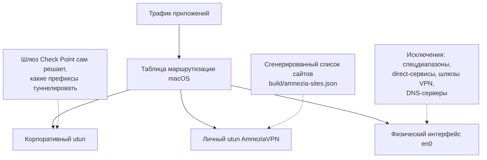

# comrades-tunnel

> **English summary.** Runs two VPNs at once on macOS: a corporate Check
> Point Endpoint Security VPN, and a personal AmneziaVPN (WireGuard/
> AmneziaWG) for everything else, with deterministic, fully regenerable
> traffic splitting plus split DNS. Measured result on the author's
> machine: switching AmneziaVPN to "all sites except the listed ones" mode
> with a generated exclusion list (~372 networks) cuts the corporate VPN's
> connect time from 3–5 minutes to ~40 seconds (the "Loading virtual
> network adapter" step: 134–137 s → 26 s) — the corporate client's
> connect-time scan of the routing table, not the VPN software itself, was
> the bottleneck. See «Основной путь» for the step-by-step primary setup,
> and «Что специфично для Check Point и что менять под другой
> корпоративный VPN» if your corporate client isn't Check Point. The rest
> of this document is in Russian.

Две VPN одновременно на macOS: корпоративный **Check Point Endpoint Security
VPN** — для корпоративных ресурсов, и личный **AmneziaVPN** (WireGuard /
AmneziaWG) — для всего остального интернета. Разбиение трафика между ними
детерминированное и полностью регенерируемое: корпоративные сети → в
корпоративный туннель; отдельные "прямые" сервисы (российские сервисы,
которые ведут себя плохо при выходе через зарубежный IP) → напрямую через
физический интерфейс; всё остальное → в личный VPN.

## Основной путь

Рекомендованная настройка end-to-end. Экономит те самые несколько минут на
каждое подключение корпоративного VPN — измеренный результат см. в конце
раздела.

1. Установите AmneziaVPN (4.8.x или 5.x) с сервером WireGuard/AmneziaWG —
   см. «Установка и обновление AmneziaVPN» ниже. Kill Switch в Amnezia
   можно оставить включённым: исключения для корпоративных DNS в него
   проставляет DNS-сторож из шага 6.

2. Скопируйте шаблон конфигурации и отредактируйте каждый файл:

   ```
   cp -r config/example local
   ```

   - `local/corp-domains.txt` — корпоративные DNS-зоны (по одной на строку),
     для которых будет создан `/etc/resolver/<zone>`. Сюда же — отдельные
     внутренние имена под публичной корпоративной зоной, у которых
     корпоративный DNS отдаёт внутренний адрес, а публичный — другой;
     типичный пример — веб-интерфейс корпоративной почты. Такое имя
     добавляется отдельной строкой как есть (сопоставление идёт по
     суффиксу, так что имя хоста работает как зона), а не весь публичный
     домен: иначе его публичные имена перестанут резолвиться при
     выключенном корпоративном VPN.
   - `local/corp-dns.txt` — IP-адреса корпоративных DNS-серверов, доступных
     через корпоративный туннель.
   - `local/corp-dns-options.txt` — дополнительные опции resolver(5),
     дописываемые после строк `nameserver` (например, `timeout 3`).
   - `local/direct-cidrs.txt` — CIDR-блоки шлюзов корпоративного VPN (как
     `/32`) и публичные корпоративные подсети.
   - `local/direct-dns.txt` — дополнительные DNS-серверы (по одной IP на
     строку), которые должны всегда идти напрямую сверх выданных по DHCP.
   - `local/direct-domains.txt` — домены, которые должны идти напрямую.
     Удобнее всего скопировать готовый пресет:
     `cp config/presets/direct-domains.ru-popular.txt local/direct-domains.txt`
     и отредактировать под себя.
   - `local/corp-hosts-check.txt` — известные корпоративные хосты для
     самопроверки `bin/check-split.sh` (их IP также исключаются из личного
     VPN).
   - `local/tunnels.txt` — префиксы `inet`-адресов двух VPN-туннелей.
     Найти их: `ifconfig | grep -A3 utun` — один из блоков `utunN` будет
     принадлежать корпоративному VPN, другой — личному (Amnezia).
   - `local/dns-guard.txt` — настройки `bin/dns-guard.sh`: желаемые
     DNS-серверы (`SERVERS`), режим (`MODE`) и `KILLSWITCH_DNS` —
     добавлять ли корпоративные DNS в исключения Kill Switch Amnezia (по
     умолчанию `auto`; всё это — в разделе про DNS ниже в «Как это
     работает»); корпоративные DNS-серверы берутся из уже заполненного
     `local/corp-dns.txt`.
   - `local/split-mode.txt` — ожидаемый режим разбиения для монитора из
     шага 7; шаблон уже содержит `MODE=exclude`, менять на `forward` нужно
     только если в Amnezia импортирован `amnezia-sites.json`.
   - `local/telegram.txt` — имена item'ов Keychain, из которых монитор
     читает токен Telegram-бота и chat id (сами значения кладутся в
     Keychain на шаге 7).

3. Сгенерируйте список исключений для режима "кроме выбранных сайтов":

   ```
   make sites-exclude
   ```

   (эквивалент `python3 bin/gen-amnezia-sites.py --mode exclude`). Скрипт
   печатает таблицу самопроверок в конце вывода — все они должны быть
   PASSED.

4. В приложении AmneziaVPN переключите режим раздельного туннелирования
   сервера на "кроме выбранных сайтов" ("All sites except the listed
   ones": сервер → "⋮" → настройки сервера → Split tunneling → режим), а
   затем импортируйте `build/amnezia-exclude.json` (тот же пункт "⋮" →
   "Заменить список сайтов") и переподключитесь.

   **Предпосылка:** в `AllowedIPs` сервера WireGuard/AmneziaWG должны быть
   одновременно `0.0.0.0/0` и `::/0` — иначе клиент молча отключает
   разбиение по сайтам целиком (amnezia-client issue #2907).

5. Установите резолверы для корпоративных DNS-зон (сначала dry-run, затем
   применить):

   ```
   sh bin/install-resolvers.sh
   sudo sh bin/install-resolvers.sh --apply
   ```

   `--apply` требует `sudo` — файлы `/etc/resolver/<zone>` пишутся от root.
   После любой правки `corp-domains.txt` или `corp-dns.txt` повторите
   этот шаг: dry-run покажет, какие файлы изменятся.

6. Установите DNS-сторож (сначала dry-run, затем применить). Он
   восстанавливает DNS Wi-Fi после перезаписи Check Point и держит
   корпоративные DNS в исключениях Kill Switch Amnezia; срабатывает по
   изменениям системного DNS и раз в 30 секунд по таймеру:

   ```
   sh bin/install-dns-guard.sh
   sudo sh bin/install-dns-guard.sh --apply
   ```

   После правки `corp-dns.txt` или `dns-guard.txt` повторите `--apply` —
   демон читает установленную копию конфига, а не `local/`.

7. Установите периодический монитор разбиения (без sudo — подробнее в
   «Мониторинг разбиения» ниже). Сначала положите в Keychain токен бота и
   chat id под именами из `local/telegram.txt`:

   ```
   security add-generic-password -a "$USER" -s <KEYCHAIN_TOKEN_ITEM> -w '<токен бота>'
   security add-generic-password -a "$USER" -s <KEYCHAIN_CHAT_ITEM> -w '<chat id>'
   make health-test-telegram
   make health-install
   ```

   Без item'ов в Keychain монитор работает, но только пишет лог, без
   уведомлений. Первый тик запускается сразу после установки.

8. Проверьте разбиение **сразу** после переключения режима:

   ```
   make check-exclude
   ```

   Если корпоративные хосты маршрутизируются неверно — верните режим на
   "только выбранные сайты" одним кликом. **Если разбиение молча не
   сработало, ВЕСЬ трафик, включая корпоративный, идёт через личный VPN**
   — поэтому проверку нужно гонять сразу после переключения, а не
   когда-нибудь потом. При поднятом корпоративном туннеле все хосты из
   `corp-hosts-check.txt` должны резолвиться и идти через корпоративный
   `utun`; `FAIL(no resolve)` означает, что корпоративный DNS через туннель
   недоступен — см. «Диагностика проблем», п. 5. Повторяйте проверку после
   каждого обновления любого из двух VPN-клиентов.

**Измеренный результат** (на машине автора): подключение корпоративного
VPN — **40 секунд** вместо 3–5 минут; шаг "Loading virtual network
adapter" — **26 секунд** вместо 134–137 секунд. Почему именно это ускоряет
подключение — см. «Почему `exclude` быстрее `forward`» и «Что специфично
для Check Point...» ниже.

Перегенерируйте список и переимпортируйте его в Amnezia при изменении
`direct-domains.txt`/`direct-cidrs.txt`, а также периодически — IP-адреса
сервисов меняются.

## Как это работает

1. Корпоративный клиент Check Point сам поднимает префиксы своего
   encryption domain в собственный `utun` и оставляет маршрут по умолчанию
   на физическом интерфейсе. Клиенту не нужна никакая настройка с нашей
   стороны, и его нельзя попросить туннелировать что-то ещё — какие сети
   туннелировать, решает только шлюз на стороне компании.
2. Split DNS для корпоративных зон через файлы `/etc/resolver/<zone>`,
   указывающие на корпоративные DNS-серверы, доступные только через
   корпоративный туннель (с `timeout 3`, чтобы резолвинг быстро падал, если
   туннель не поднят). Эти файлы переживают любой VPN-клиент, который
   перезаписывает системный DNS.
3. Рекомендованный режим AmneziaVPN — "кроме выбранных сайтов" (`--mode
   exclude`, генератор строит список **исключений** — см. «Основной путь»
   выше); он в разы быстрее по времени подключения корпоративного VPN, чем
   режим "только выбранные сайты" (`--mode forward`, где генератор строит
   список сайтов как дополнение всего IPv4-пространства минус те же
   исключения) — см. «Почему `exclude` быстрее `forward`» ниже.
   Longest-prefix-match в таблице маршрутизации оставляет корпоративные
   префиксы в корпоративном туннеле, даже если адресное пространство RFC
   1918 целиком исключено из списка личного VPN.



DNS устроен отдельно от маршрутизации трафика: запрос к корпоративной зоне
уходит через `/etc/resolver/<zone>` на корпоративный DNS-сервер, доступный
только через корпоративный туннель; запрос к любому другому имени идёт через
обычный системный резолвер как обычно.

### DNS: клиент Check Point переписывает DNS Wi-Fi

При подключении корпоративный клиент Check Point Endpoint Security VPN сам
переписывает DNS-серверы основного сетевого сервиса (Wi-Fi) на слое Setup —
том же слое, что System Settings и `networksetup -setdnsservers`: он
дописывает в начало списка корпоративные DNS-серверы и свои search domains,
оставляя DHCP-серверы позади них.
Что бы ни стояло там раньше (например, DNS личного VPN), оно теряется.

Следствие: пока корпоративный DNS стоит первым в списке, часть публичных
имён не резолвится — например, видеохостинги фильтруются корпоративной DNS.
Ручная правка (`networksetup -setdnsservers Wi-Fi ...`) не помогает: клиент
переписывает тот же слой при каждом переподключении, так что изменение живёт
только до следующего reconnect.

Split-DNS для корпоративных зон через `/etc/resolver/<zone>` (см. выше)
работает независимо от системного списка DNS-серверов, поэтому убрать
корпоративные серверы из этого списка ничего не ломает.

`bin/dns-guard.sh`, установленный `bin/install-dns-guard.sh` как
LaunchDaemon, следит за
`/Library/Preferences/SystemConfiguration/preferences.plist` и
`/private/var/run/resolv.conf` (плюс запуск при загрузке и раз в 30 секунд
по таймеру — см. про Kill Switch ниже) и восстанавливает
желаемый список DNS-серверов, не трогая search domains. Строка `ok` в
логе пишется только при изменении состояния, чтобы таймер не засорял лог. Два режима:
`corp-only` (по умолчанию) — вмешивается только когда в текущем списке
обнаружен один из корпоративных DNS-серверов; `always` — приводит список к
заданным серверам при любом расхождении.

Что именно ставить, задаёт `SERVERS` в `dns-guard.txt`: либо список
серверов (например, резолверы личного VPN), либо слово `dhcp` — тогда
сторож не ставит свой список, а **очищает** ручной
(`networksetup -setdnsservers <service> Empty`), и DNS возвращается к
тому, что выдал DHCP текущей сети. Для ноутбука, который ходит между
домом и офисом, `dhcp` предпочтительнее: ручной список живёт в слое
Setup сетевого сервиса и действует на **любой** сети, пока его кто-нибудь
не перепишет — то есть фиксированный `1.1.1.1` продолжит подменять
офисный или домашний DHCP-резолвер и после того, как перезапись Check
Point, которая его вызвала, давно закончилась (а корпоративный файрвол
может и вовсе не выпускать порт 53 к публичному резолверу). Очистка же
просто отдаёт DNS той сети, где вы сейчас; корпоративные зоны при этом
резолвятся через `/etc/resolver/<zone>` в обоих вариантах. Вручную то же
самое делает `make dns-reset`.

Отдельно сторож прикрывает Kill Switch AmneziaVPN: его pf-правило
`310.blockDNS` пропускает порт 53 только к собственным DNS Amnezia, из-за
чего корпоративные резолверы из `/etc/resolver/<zone>` перестают отвечать,
а штатное поле «DNS exceptions» в настройках Amnezia на macOS до таблицы
pf не доходит (amnezia-client issue #2513, воспроизводится на 5.0.1). При
`KILLSWITCH_DNS=auto` (по умолчанию) в `dns-guard.txt` сторож при каждом
срабатывании, и ещё раз через 5 секунд, добавляет серверы из
`corp-dns.txt` в таблицу `<dnsaddr>` якоря `amn/310.blockDNS`, если якорь
загружен. Amnezia перезаписывает таблицу при каждом переподключении и при
некоторых сетевых событиях, которые не меняют DNS-файлы (замечено при
подключении Check Point: таблица была перезаписана уже после того, как
перезапись DNS разбудила сторожа), поэтому кроме WatchPaths сторож
запускается и по таймеру раз в 30 секунд.
`KILLSWITCH_DNS=off` отключает любое вмешательство в pf. Подробности —
«Диагностика проблем», п. 5.

Зачем это нужно не только ради «фильтрует видеохостинги»: корпоративный
DNS отдаёт **настоящие** адреса зарубежных сервисов, а домашний роутер с
собственным VPN и подменой DNS (fake-IP, диапазон `198.18.0.0/15`) —
подставные, по которым он сам уводит трафик в свой туннель. Пока
корпоративный сервер стоит первым, запрос к нему уходит внутрь
корпоративного туннеля, роутер его не видит, ответ настоящий, и
соединение уходит напрямую с российского IP — сервисы с гео-блокировкой
(например, API Anthropic: `403 Request not allowed`) перестают работать,
хотя без корпоративного VPN всё в порядке. Стоит корпоративному серверу
уйти из списка, как запрос снова достаётся роутеру — и всё работает.

Установка (сначала dry-run, затем применить):

```
sh bin/install-dns-guard.sh
sudo sh bin/install-dns-guard.sh --apply
```

Удаление:

```
sudo sh bin/install-dns-guard.sh --uninstall
```

`--apply` и `--uninstall` требуют `sudo`: скрипт и конфиг копируются в
`/Library/Application Support/comrades-tunnel/` от root, LaunchDaemon ставится
в `/Library/LaunchDaemons/`. Копия root-owned намеренно: демон исполняет её от
root при каждом срабатывании, и если бы вместо этого он запускал файл прямо
из домашней директории пользователя, это была бы дыра для повышения
привилегий — что угодно, способное писать в эту директорию, могло бы
подменить код, который затем выполнится от root.

В System Settings → General → Login Items & Extensions → «Allow in the
Background» (и в уведомлении macOS «Background Items Added») демон виден
под именем скрипта — `dns-guard.sh`: plist запускает скрипт напрямую, а не
как `/bin/sh <скрипт>`, иначе macOS показала бы анонимный `sh`, не отличимый
от любого другого shell-демона. То же касается `route-lift-watcher.sh` и
`split-health.sh`.

Установщик отказывается ставить скрипт в директорию, чей какой-либо
предок доступен на запись непривилегированному пользователю (и потому
позволяет ему подменить исполняемый демоном файл) — например, не ставит в
`/usr/local/...`, где Homebrew делает директории доступными пользователю на
запись. `--apply` перед установкой проверяет всю цепочку предков и выходит с
ошибкой, если какой-то из них не принадлежит root или имеет права на запись;
`--dry-run` просто показывает такой отчёт (`ok:` / `UNSAFE:`).

Логи: `/var/log/comrades-tunnel-dns-guard.log`. Проверка после
переподключения корпоративного VPN:

```
networksetup -getdnsservers Wi-Fi
tail /var/log/comrades-tunnel-dns-guard.log
```

### Что никогда не попадает в личный VPN

Список исключений, из которого генератор (`bin/gen-amnezia-sites.py`) строит
дополнение:

- специальные/приватные диапазоны IPv4 — `0.0.0.0/8`, `10.0.0.0/8`,
  `100.64.0.0/10`, `127.0.0.0/8`, `169.254.0.0/16`, `172.16.0.0/12`,
  `192.0.0.0/24`, `192.0.2.0/24`, `192.168.0.0/16`, `198.18.0.0/15`,
  `198.51.100.0/24`, `203.0.113.0/24`, `224.0.0.0/4`, `240.0.0.0/4`;
- `direct-cidrs.txt` — IP-адреса шлюзов корпоративного VPN (как `/32`) и
  публичные корпоративные подсети (найденные через whois);
- резолвленные IP-адреса хостов из `corp-hosts-check.txt`;
- DNS-серверы, выданные по DHCP на основном интерфейсе, плюс любые лишние IP
  из `direct-dns.txt` (например, офисный резолвер на сети, где DHCP его не
  выдаёт);
- `direct-domains.txt`, расширённый до целых автономных систем через
  RIPEstat, когда это безопасно: ASN зарегистрирован как RU в делегированном
  файле RIPE NCC
  (`https://ftp.ripe.net/pub/stats/ripencc/delegated-ripencc-extended-latest`)
  и анонсирует не больше 200 префиксов IPv4 — иначе исключаются только
  резолвленные `/32`.

Почему именно так: IP-адреса CDN меняются со временем, поэтому просто
резолвить домен раз и навсегда недостаточно — но исключать целиком
иностранное облако вроде Cloudflare было бы неправильно, а исключать целиком
крупного российского провайдера вроде "Ростелекома" с тысячами префиксов
раздувает список до неприемлемого размера. Отсюда правило: расширяем до
целой ASN только когда она зарегистрирована в России и анонсирует
ограниченное число префиксов.

Для отдельных строк `direct-domains.txt` поведение можно переопределить
токеном после домена: `<домен> asn` — принудительно расширить до всей ASN
вне зависимости от страны/лимита, `<домен> ip` — расширять только
резолвленными `/32`.

Результаты запросов к RIPEstat и файл RIPE NCC кэшируются в `build/cache/`
на 7 дней. `--refresh` заставляет перекачать кэш заново, `--no-asn`
полностью отключает расширение до ASN (только резолвленные `/32`, как
раньше).

Вывод генератора именован по конфигу: `--config local/` (или без флага)
по-прежнему пишет прямо в `build/`, а любой другой `--config` — в
`build/<имя-каталога-конфига>/` (например, `build/example/`), так что
прогон на демо-конфиге не может случайно затереть настоящий список.

#### Почему не "все российские сети"

Исключить из личного VPN вообще все сети, зарегистрированные в России, можно
было бы взять напрямую из делегированного файла RIPE NCC — но это ~21 700
записей, и AmneziaVPN устанавливает маршруты по одному. С пресетом из 28
популярных сервисов (`config/presets/direct-domains.ru-popular.txt`)
итоговый список — около 2 200 сетей, что на порядок меньше и не создаёт
проблем клиенту при импорте и подключении.

### Почему `exclude` быстрее `forward`

По исходникам клиента (тег 4.8.11.4, `client/daemon/daemon.cpp` →
`MacosRouteMonitor::addExclusionRoute`) режимы различаются на уровне
маршрутов ядра, а не только по смыслу списка: "только выбранные сайты"
(`--mode forward`) ставит один маршрут на каждую сеть списка — сегодня это
~2200 сетей; "кроме выбранных сайтов" (`--mode exclude`, `make
sites-exclude`, основной режим — см. «Основной путь» выше) ставит всего
четыре фиксированных маршрута на половины адресного пространства в свой
`utun` плюс один маршрут через физический шлюз на каждую исключённую сеть —
сегодня 372 сети, то есть суммарно ~376 маршрутов. Именно число маршрутов в
таблице замедляет подключение Check Point (свой connect-time scan таблицы
маршрутизации — см. «Что специфично для Check Point...» ниже), что
подтверждено измерением на машине автора: подключение корпоративного VPN —
40 с (`exclude`) вместо 3–5 мин (`forward`); шаг "Loading virtual network
adapter" — 26 с вместо 134–137 с. Более ранняя, грубая оценка по числу
маршрутов (2222 маршрута ≈ 3 мин; 381 ≈ 54 с; 81 с `--no-asn` ≈ 33 с; 25
гипотетических ≈ 29 с) была линейной экстраполяцией по двум точкам, а не
измерением — с тех пор подтверждены измерением именно крайние точки
(`forward`/`exclude`), это и есть измеренный результат выше.

**Предпосылка:** в `AllowedIPs` сервера WireGuard/AmneziaWG должны быть
одновременно `0.0.0.0/0` и `::/0` — иначе клиент молча отключает разбиение
по сайтам целиком (amnezia-client issue #2907). Строка `AllowedIPs`
читается в настройках сервера в приложении (сервер → "⋮" → настройки
сервера → конфигурация WireGuard/AmneziaWG); режим переключается там же,
где выбирается "только выбранные сайты"/"кроме выбранных сайтов" (Split
tunneling → режим).

## Что специфично для Check Point и что менять под другой корпоративный VPN

Этот раздел — для тех, у кого корпоративный VPN не Check Point Endpoint
Security VPN. Часть выигрыша в скорости и часть инструментов этого
репозитория завязаны на конкретные особенности клиента Check Point;
конкретно:

- **Connect-time сверка таблицы маршрутизации.** Клиент Check Point при
  подключении сверяет каждый свой маршрут со всей таблицей маршрутизации
  macOS, и это резко замедляется, когда маршрутов тысячи (см. «Почему
  `exclude` быстрее `forward`» выше) — именно это и решает «Основной
  путь». **Если ваш клиент не делает такую сверку**, то и проблема
  медленного подключения из-за размера таблицы маршрутизации у вас, скорее
  всего, отсутствует — можно пропустить всё, что в этом README касается
  скорости подключения, и использовать разбиение только ради маршрутизации
  трафика. Замените на: профилирование подключения вашего клиента (логи,
  `Instruments`/`dtrace`), чтобы подтвердить или исключить эту причину
  самостоятельно.
- **Имя демона `com.checkpoint.epc.service` и пути CLI `trac`.** Раздел
  «Диагностика проблем» ниже лечит зависший root-демон через
  `launchctl kickstart -k system/com.checkpoint.epc.service` и опрашивает
  `"/Library/Application Support/Checkpoint/Endpoint Connect/trac" info`.
  Замените на: имя LaunchDaemon/LaunchAgent и путь CLI вашего клиента (если
  он есть) — `launchctl print system/<label>` покажет, зарегистрирован ли
  сервис под этим именем.
- **Путь `helpdesk.log` и маркеры, которые парсит route-lift-watcher.**
  `bin/route-lift-watcher.sh` следит именно за файлом `helpdesk.log`
  Check Point и ищет в нём строки "Starting connect"/"Starting new
  connection", "Connection was successfully established", "Interface
  change", "Reconnect finished successfully", "Policy changed, restarting
  connection" и "no need executing firewall step" (подробности — в
  «Запасные пути и страховки» ниже). Замените на: собственный лог
  подключения вашего клиента и его собственные маркеры начала/конца
  переподключения — многие клиенты вообще не пишут такой лог, и тогда
  этот конкретный инструмент неприменим.
- **Setup-layer перезапись DNS**, которую компенсирует `dns-guard.sh` (см.
  «DNS: клиент Check Point переписывает DNS Wi-Fi» выше). Проверьте, делает
  ли ваш клиент то же самое: подключитесь и сравните
  `networksetup -getdnsservers Wi-Fi` до/после. Если ваш клиент не
  переписывает DNS на этом слое (или переписывает иначе, например только
  через собственный резолвер поверх системного) — `dns-guard.sh` не нужен.
- **Динамический адрес "Office Mode" и почему `CORP_TUNNEL_PREFIX` должен
  быть широким.** Check Point выдаёт адрес виртуального адаптера
  динамически при каждом подключении (третий октет меняется от сессии к
  сессии), поэтому `tunnels.txt`/`CORP_TUNNEL_PREFIX` и ожидание нового
  `utun` в `cp-connect.sh`/`route-lift-watcher.sh` не полагаются на один
  фиксированный адрес. Замените на: то, как ваш клиент назначает адрес
  своему туннельному интерфейсу — если он стабилен (например, всегда один
  и тот же адрес или подсеть), достаточно точного префикса вместо
  широкого.

## Запасные пути и страховки

Всё в этом разделе — опционально. Если exclude-режим у вас работает (см.
«Основной путь» и `make check-exclude`), можно пропустить этот раздел
целиком: ничего из перечисленного здесь не нужно для решения проблемы
медленного подключения.

### Ускорение подключения: bin/cp-connect.sh

Клиент Check Point при подключении сверяет каждый свой маршрут со всей
таблицей маршрутизации, поэтому время подключения растёт вместе с её
размером — а размер задают в основном ~2200 маршрутов личного AmneziaVPN
**в режиме `forward`**. `bin/cp-connect.sh` на несколько секунд ужимает
таблицу, пока подключается Check Point, и сразу восстанавливает личный
VPN. Три метода (`--method`), от безопасного к рискованному: `prompt` (по
умолчанию, без sudo) — просит нажать Disconnect/Connect в GUI Amnezia;
`routes` (sudo) — не трогает приложение и туннель, только удаляет и
восстанавливает маршруты на её `utun`; `launchd` (sudo, экспериментальный)
— перезапускает демон `AmneziaVPN-service`, но сам WireGuard-туннель живёт
в отдельном дочернем `wireguard-go`, который демон, похоже, не
останавливает, так что маршруты, скорее всего, переживут перезапуск.
`--method ipc` не реализован для реального запуска: control-socket Amnezia
говорит бинарным Qt Remote Objects, а не текстом, которым можно управлять
через `nc`. Восстановление гарантировано `trap`-ом на EXIT/INT/TERM; для
`routes` маршруты сохраняются в `build/cp-connect-saved-routes.txt` до
удаления, и команда для ручного восстановления печатается в начале
работы. pf-based policy routing (`route-to`) для этой задачи не подходит:
по Apple TN3165 "Packet Filter is not API", pf не влияет на
локально-сгенерированный на Mac трафик.

`--method routes` теперь считает успехи и неудачи каждой команды `route`, а
после восстановления сверяет число маршрутов на `utun` личного VPN с тем,
что было сохранено — при любом расхождении или неудаче скрипт громко
предупреждает и завершается ненулевым кодом. Путь восстановления всё тот
же: файл `build/cp-connect-saved-routes.txt` и напечатанная в начале работы
команда для ручного восстановления.

`--method routes` также никогда не трогает маршруты из `keep-routes-for.txt`
(см. ниже) — их сохранение/удаление пропускается целиком. `--method prompt`
этим воспользоваться не может: он отключает весь интерфейс личного VPN, так
что вместе с ним пропадают вообще все маршруты, включая те, что перечислены
в `keep-routes-for.txt`.

Ожидание корпоративного VPN не полагается только на `CORP_TUNNEL_PREFIX`:
Check Point выдаёт Office Mode адрес динамически, поэтому появление любого
нового `utun`, кроме личного VPN, тоже считается признаком подключения, а
по таймауту скрипт печатает список интерфейсов вместо молчания. Если
корпоративный VPN уже подключён на старте, скрипт отказывается продолжать,
ничего не трогая (иначе измеренное время подключения было бы бессмысленным);
`--force` снимает этот отказ, а время подключения тогда печатается как `n/a`.

### Автоматика: bin/route-lift-watcher.sh

Актуально, только если exclude-режим недоступен — например, контейнер
AmneziaWG, задетый amnezia-client issue #2907 (см. предпосылку в «Почему
`exclude` быстрее `forward`» выше), из-за которого разбиение по сайтам
приходится держать в режиме `forward` с полным списком маршрутов.

`cp-connect.sh` ужимает таблицу только когда корпоративный VPN подключает
человек вручную. Но полное переподключение Check Point происходит и само —
по журналу `helpdesk.log` за 295 дней видно примерно 1.5–2 автоматических
полных переподключения в день (выход из сна, roaming timeout, always-connect
retry), и раньше каждое платило те же 2–3.5 минуты. `route-lift-watcher.sh`
следит за тем же `helpdesk.log`, которым пишет сам Check Point: строка
"Starting connect"/"Starting new connection" без последующего "Connection was
successfully established" — сигнал начать; на короткие "Interface change" /
"Reconnect finished successfully" и "Policy changed, restarting connection"
(виртуальный адаптер не пересоздаётся) он не реагирует. При срабатывании
скрипт сохраняет и удаляет маршруты личного VPN тем же кодом, что и
`cp-connect.sh --method routes` (общий `bin/lib-routes.sh`), ждёт завершения
подключения или таймаута (по умолчанию 240с) и восстанавливает маршруты.

Момент срабатывания настраивается через `LIFT_TRIGGER` (в `tunnels.txt`/
`route-lift.conf`) или флаг `--trigger`: `connect-start` (по умолчанию) —
надёжный, но более широкий интервал; `pre-scan` — ждёт последнего маркера
перед самим сканированием, строку "no need executing firewall step" в том
же `helpdesk.log` (и только если раньше уже видели начало подключения без
завершения с тех пор), что сокращает окно простоя примерно до длительности
самого сканирования, но это более узкое окно гонки: если скрипт не успеет
среагировать, сканирование может начаться раньше, чем подняты маршруты, и
подключение будет таким же медленным, как без этого скрипта — упущенная
оптимизация, а не поломка. Каждый завершённый цикл пишет в лог и в
`--status`, сколько секунд маршруты реально отсутствовали — именно это
число определяет, переживёт ли простой долгий streaming-запрос через
личный VPN (см. ниже).

Сети предохранителей, каждая независимо: жёсткий таймаут восстанавливает
маршруты безусловно; `trap` на EXIT/INT/TERM восстанавливает их при любом
завершении процесса; отдельная периодическая проверка (раз в минуту,
`StartInterval`) обнаруживает и чинит рассинхронизацию за минуту, даже если
процесс, который удалил маршруты, аварийно завершился; блокировка на
`mkdir` не даёт двум срабатываниям выполняться одновременно.

Установка (сначала dry-run, затем применить):

```
sh bin/install-route-lift-watcher.sh
sudo sh bin/install-route-lift-watcher.sh --apply
```

Удаление: `sudo sh bin/install-route-lift-watcher.sh --uninstall`. Лог:
`/var/log/comrades-tunnel-route-lift.log`. Статус: `make route-lift-status`
(или `sh bin/route-lift-watcher.sh --status`). Скрипт трогает только
маршруты личного VPN — сам корпоративный клиент он никогда не изменяет.

### Что происходит с уже открытыми соединениями через личный VPN, пока маршруты подняты

Пока маршруты личного VPN подняты (сохранены и удалены на время
корпоративного подключения — `cp-connect.sh`/`route-lift-watcher.sh`), уже
открытые соединения через этот VPN не рвутся мгновенно — они зависают.
Причина в том, как macOS обрабатывает удаление маршрута: сокет уже
установленного соединения хранит исходный адрес источника, назначенный
туннелем, а при удалении маршрута ядро просто делает новый поиск в таблице
для следующего пакета и попадает на маршрут по умолчанию — то есть пакет
уходит через физический интерфейс, но всё ещё с адресом источника из
личного VPN, и ответы на него вернуться не могут. TCP обычно переживает
такое зависание в десятки секунд и продолжает работу после восстановления
маршрутов; страдают в первую очередь таймауты на уровне приложений и
долгие streaming-ответы (например, потоковый ответ от LLM API) — они
рвутся раньше, чем маршруты восстановятся. Режим `pre-scan` (см. выше)
сокращает это окно примерно до длительности сканирования Check Point,
`connect-start` держит его шире, но надёжнее. Отдельные адреса можно
защитить от простоя вообще — см. следующий раздел. Для сравнения:
`cp-connect.sh --method prompt` — жёстче: он полностью отключает личный
VPN, интерфейс исчезает, и приложения получают мгновенную сетевую ошибку, а
не зависание.

### Защита LLM-провайдеров от простоя: keep-routes-for.txt

Если долгоживущее соединение (например, стриминговый агент, читающий ответ
от LLM API) идёт только через личный VPN и не может быть переключено в
`direct-domains.txt`, его можно защитить от простоя явно: домены или
CIDR/IP в `keep-routes-for.txt` (по одному на строку, пример — в
`config/example/keep-routes-for.txt`, уже с типичными LLM API) не удаляются
из таблицы маршрутизации при подъёме, вместе с `cp-connect.sh --method
routes`. Удаление ~2200 маршрутов, кроме нескольких, не даёт заметной
разницы в скорости сканирования Check Point, зато простоя для этих
адресов не будет вовсе — маршрут никуда не денется. Домены резолвятся в
IPv4 прямо перед удалением, пока туннель ещё поднят, поэтому резолвинг идёт
через тот же путь, которым реально ходит трафик. **Предохранитель:** если в
файле есть активные записи, но ни одна не резолвится/не парсится (нет
`python3`, все проверки упали) — подъём маршрутов в этом цикле не
выполняется вовсе, чтобы не удалить маршрут, который файл должен был
защитить; при этом отдельный неудачный домен на фоне остальных успешных —
не ошибка. `--method prompt` этой защитой воспользоваться не может (см.
предыдущий раздел). `--dry-run` у обоих скриптов показывает реальный
результат резолвинга и итоговый keep-set, ничего не трогая.

### Пауза автоматики на время долгого стриминга: --pause/--resume

Для job'ов, которые не покрыты `keep-routes-for.txt` (например, разовый
долгий запуск через нестандартный адрес), `route-lift-watcher.sh --pause
[МИНУТЫ]` (по умолчанию 60, максимум 480) откладывает решение о подъёме
маршрутов на заданное время — `--resume` снимает паузу раньше срока. Пауза
истекает сама по себе, бессрочной паузы не бывает. Пока она активна,
автоматическое переподключение Check Point снова станет медленным (2–3.5
минуты) — это осознанный компромисс ради непрерывности стрима. Предохранитель
безопасности (`StartInterval`) продолжает работать даже во время паузы и
всё равно восстановит уже поднятые маршруты. Через Makefile: `make
route-lift-pause MINUTES=90` / `make route-lift-resume` (обе цели требуют
sudo, т.к. пишут в каталог состояния установленного демона).

### Компромисс: размер списка сайтов vs скорость подключения корпоративного VPN

Актуально только для режима `forward` (список сайтов): в режиме `exclude`
`--max-sites` игнорируется с предупреждением, потому что сжимать там
нечего — исключений и так на порядок меньше (см. «Основной путь» и «Почему
`exclude` быстрее `forward`» выше).

Каждая сеть из `amnezia-sites.txt` после импорта в AmneziaVPN — это
отдельный маршрут в таблице маршрутизации macOS. При подключении
корпоративный клиент Check Point сверяет свои собственные маршруты с
каждым уже существующим маршрутом в таблице, и эта сверка резко
замедляется, когда маршрутов тысячи: с полным списком (~2200 сетей)
подключение занимает 2–5 минут вместо нескольких секунд.

`--max-sites N` у `bin/gen-amnezia-sites.py` ужимает список: сортирует
промежутки между исключениями по размеру и жадно сливает САМЫЕ МАЛЕНЬКИЕ
из них с соседними исключениями, пока итог не уложится в N сетей.
Слияние только добавляет адреса в исключения, поэтому всё, что обязано
идти в обход личного VPN, идёт в обход и после сжатия — но платой служит
то, что чуть больше адресного пространства, чем строго необходимо, тоже
уходит в обход напрямую, а не через личный VPN.

`make sites-small` генерирует список с бюджетом 400 сетей по умолчанию
(`MAX_SITES=N` переопределяет), `MAX_SITES=N make sites` — тот же приём
для обычной генерации.

Слияние промежутков размер-приоритетно и ничего не знает о важности адреса —
поэтому `local/keep-tunneled.txt` фиксирует IP/CIDR, которые обязаны остаться
в личном VPN при любом бюджете: промежуток, который их содержит, никогда не
сливается, даже если он самый маленький. По умолчанию туда занесены
публичные DNS-резолверы (`1.1.1.1`, `8.8.8.8` и т.д.) — личный VPN несёт весь
DNS-трафик, и потеря резолвера меняет поведение резолвинга имён. Если при
заданном `--max-sites` все оставшиеся промежутки защищены и бюджет
недостижим, генератор печатает WARNING и оставляет список как есть, а не
жертвует защищёнными адресами ради бюджета.

### Веб-UI для логов и состояния: bin/logs-ui.py

Локальная страница вместо ручного чтения трёх логов и файлов состояния:
сводка (корпоративный/личный `utun`, число маршрутов, режим сплита из
`local/split-mode.txt`, загружены ли три launchd-задачи), таблица
состояний `bin/split-health.sh` и три лог-пейна (`dns-guard`, `route-lift`,
`split-health`) с фильтром и подсветкой ERROR/FAIL/WARNING. Полностью
read-only, слушает только `127.0.0.1:8765`, страница опрашивает
`/api/state` раз в 10 секунд.

```
make logs-ui              # запустить на переднем плане, откроется на http://127.0.0.1:8765/
make logs-ui-install      # установить и загрузить LaunchAgent (без sudo)
make logs-ui-uninstall    # выгрузить и удалить LaunchAgent
```

`/var/log/comrades-tunnel-dns-guard.log` и `-route-lift.log` пишет root; если
они не world-readable, страница вместо содержимого покажет точную команду
`sudo chmod 644 <path>` — её нужно выполнить вручную, сам скрипт sudo не
вызывает.

## Установка и обновление AmneziaVPN

Десктопный клиент для macOS — `.pkg` со страницы релизов
`amnezia-vpn/amnezia-client` на GitHub. «Latest» на главной — ветка 5.x;
последний стабильный релиз 4.8 — `4.8.21.0` (2026-07-10, stable, не
pre-release) — находится через список тегов. Сторонние зеркала и
менеджеры пакетов не использовать. Отдельно есть сборка 5.x для Mac App
Store (NetworkExtension вместо LaunchDaemon) — скрипты этого репозитория
(`AmneziaVPN-service`, имя процесса туннеля, ключи plist) рассчитаны
только на `.pkg` с GitHub.

Файлы и SHA-256 (`shasum -a 256 <file>` после скачивания):

- `AmneziaVPN_4.8.21.0_macos.pkg` —
  `da339236eef1728956197c8bf9ed96a2a21047270106e6c0aa062c9e142e3ac7` —
  единственный macOS-файл релиза; только x86_64 (app, `AmneziaVPN-service`,
  туннель `wireguard-go`).
- `AmneziaVPN_5.0.1.5_macos_x64.pkg` —
  `8e88c02605375400a7972ee5205cc6bcd223e555757522fbc97fe3c9a4946084` —
  несмотря на `_x64`, universal (x86_64 + arm64); туннель переименован в
  `amneziawg-go`. С этим проектом работает (проверено на Apple Silicon,
  macOS 26), но его Kill Switch по умолчанию режет DNS-запросы к
  корпоративным серверам через корпоративный туннель — `bin/dns-guard.sh`
  (`KILLSWITCH_DNS=auto`) сам вносит корпоративные DNS в его исключения,
  см. «Диагностика проблем», п. 5; у 5.x открытые проблемы на macOS 26.
- `AmneziaVPN_4.8.11.4_macos.zip` (откат на 4.8.11.4, zip с
  `AmneziaVPN.pkg` внутри) —
  `9534563bd7810ab7bf9f920dad2ec3efc78095b4d170bdbd79ba16cbb8e93dbb`.

**Установщик (проверено на 4.8.21.0).** Package identifier
`org.amneziavpn.package` — установка поверх пакета с тем же identifier
это upgrade in place. Выбор «Install» (по умолчанию) / «Uninstall» — при
обновлении **не выбирать Uninstall**. postinstall выгружает старый
LaunchDaemon, ставит приложение, кладёт plist в
`/Library/LaunchDaemons/AmneziaVPN.plist`, загружает его и перезапускает
приложение; ребут не нужен. `~/Library/Preferences` не трогается —
профили серверов и списки сайтов переживают апгрейд (идентификаторы
настроек в 4.8.x не менялись). Предупреждение в release notes про
удаление «4.8.8.2 и ниже через .dmg» к `.pkg`-апгрейдам не относится.

Процедура одна для установки и для обновления:

1. Бэкап настроек плюс экспорт конфигурации сервера из приложения (меню →
   Backup → Export):

   ```
   cp -p ~/Library/Preferences/org.amneziavpn.AmneziaVPN.plist \
     ~/Documents/org.amneziavpn.AmneziaVPN.plist.bak-$(date +%Y%m%d-%H%M%S)
   ```

2. Отключить VPN, выйти из приложения через меню-бар, проверить, что
   процесс не остался (вывод должен быть пустым):

   ```
   pgrep -fl AmneziaVPN
   ```

3. Открыть `.pkg`, оставить «Install», ввести пароль администратора —
   установщик сам перезапускает демон и приложение.

4. Проверить версию, демон и туннель:

   ```
   defaults read /Applications/AmneziaVPN.app/Contents/Info.plist CFBundleShortVersionString
   plutil -p /Library/LaunchDaemons/AmneziaVPN.plist
   pgrep -fl wireguard-go
   ```

   Ожидается label `AmneziaVPN-service`, порт `5959`; `wireguard-go` —
   после подключения. Затем `make check` — убедиться, что разбиение не
   сломалось.

5. Откат: выйти из приложения, поставить предыдущий `.pkg`; бэкап
   восстанавливать только при явной порче настроек и при закрытом
   приложении.

Обновление клиента и переключение режима разбиения (см. «Почему `exclude`
быстрее `forward`» выше) — раздельные шаги с проверкой между ними: одна
переменная за раз.

### Apple Silicon

Вся ветка 4.8 собрана только под Intel и на Apple Silicon работает под
Rosetta 2. Из трекера issues: установщик может падать на чистой машине
без Rosetta (issue #2744, 4.8.18.0 — чинится
`softwareupdate --install-rosetta`; не подтверждено, воспроизводится ли
это на пакете `4.8.21.0`), а туннель под трансляцией репортили как
причину, по которой первое подключение AmneziaWG-v2 занимает несколько
минут (issue #2650, 4.8.15.4, архитектурно — стоит ожидать и на
4.8.21.0). Нативный Apple Silicon в `.pkg` с GitHub — с 5.0.0.5. Выбор на
Apple Silicon: `4.8.21.0` под Rosetta (проверена автором только на
Intel) либо `5.0.1.5` нативно (с этим проектом работает; про Kill Switch
см. «Диагностика проблем», п. 5; открытые проблемы на macOS 26). Consent одинаков на обеих архитектурах — обычный
LaunchDaemon без системных расширений, только «Background Items Added»;
подпись и нотаризация идентичны.

Файл: Intel + 4.8.21.0 → `AmneziaVPN_4.8.21.0_macos.pkg`; Apple Silicon +
4.8.21.0 → тот же файл под Rosetta; Apple Silicon + 5.0.1.5 →
`AmneziaVPN_5.0.1.5_macos_x64.pkg` (universal, несмотря на имя).

## Makefile

Все шаги выше можно выполнять через `make` — обёртку над теми же
скриптами. `make help` показывает все цели, сгруппированные по разделам.
Самые ходовые: `make sites` (сгенерировать список сайтов), `make check`
(проверить фактическое разбиение маршрутов), `make dns-guard` (посмотреть,
что сделает DNS-сторож, без применения), `make dns-guard-install`
(установить сторожа, требует sudo), `make dns-reset` (вернуть DNS
основного сетевого сервиса к DHCP, требует sudo). Цели, которым нужен
sudo, вынесены отдельно от своих dry-run вариантов и перед действием
печатают предупреждение с тем, что именно будет изменено. Любую цель
можно прогнать на демонстрационном конфиге вместо `local/`:
`make CONFIG=config/example <цель>`. Относительный путь в `CONFIG=`/
`--config` сначала проверяется относительно текущей директории, а если
там такого каталога нет — относительно корня репозитория, так что команды
работают из любой директории, не только из корня репозитория.

```
make help
make sites
make check
make CONFIG=config/example check
```

## Мониторинг разбиения: bin/split-health.sh

`bin/check-split.sh` — ручная проверка: сработает, только если её реально
запустить. Молчаливый отказ разбиения в режиме "кроме выбранных сайтов"
(`--mode exclude`) — самый опасный сценарий этого проекта: **весь**
трафик, включая корпоративный, уходит через личный VPN, а внешне ничего не
меняется. `bin/split-health.sh` закрывает этот пробел периодической
проверкой вместо разовой команды.

Проверки на каждом тике (пороги и детали — в шапке скрипта): (1) FAIL —
хост из `corp-hosts-check.txt` или сеть/шлюз из `direct-cidrs.txt` идёт
через личный VPN (опасно в любом режиме), WARN — хосты из
`corp-hosts-check.txt` не резолвятся при поднятом корпоративном `utun`
(маршрутизация не проверена — см. «Диагностика проблем», п. 5); (2) FAIL — личный VPN поднят, но
число маршрутов на его `utun` не соответствует режиму из
`local/split-mode.txt` (`exclude` — больше 50 вместо ~4, `forward` —
меньше 50 при сотнях сетей в списке); (3) WARN — на основном интерфейсе
появился глобальный IPv6, а список исключений покрывает только IPv4; (4)
WARN — DNS основного сервиса опять начинается с корпоративного сервера (то
же условие, на которое реагирует `dns-guard.sh`, только с уведомлением
вместо исправления).

Вместо одного таймера "список не обновлялся 30 дней" — три проверки
реального дрейфа, каждая ловит свою причину рассинхронизации:

- **Симптом, на каждом тике** (до ~30с суммарно) — резолвит прямо сейчас
  каждый домен из `direct-domains.txt` и публичные адреса из
  `corp-hosts-check.txt`, и проверяет, покрывает ли их текущий
  сгенерированный список. Ловит смену IP у сервиса раньше, чем это
  проявится как утечка трафика.
- **Причина, не чаще раза в 7 дней** — перегенерирует список в фоне с
  `--refresh` (реальный запрос к RIPEstat/RIPE NCC) и сравнивает с уже
  сгенерированным. Ловит смену анонсируемых ASN префиксов у провайдера —
  то, что первая проверка не видит, потому что резолвит только уже
  известные адреса.
- **Сгенерированный vs импортированный, на каждом тике** — сравнивает
  файл в `build/` с тем, что реально импортировано в AmneziaVPN (читает
  `~/Library/Preferences/org.amneziavpn.AmneziaVPN.plist`, только ключ
  списка сайтов, без сервера). Ловит "перегенерировал, но забыл
  переимпортировать".
- Старый таймер "список не обновлялся 30 дней" остался как WARN самого
  низкого приоритета — свежий список ещё не значит правильный, а старый
  ещё не значит устаревший, но регенерация раз в несколько месяцев тоже
  стоит напоминания.

Без спама: Telegram-сообщение уходит только при смене статуса (OK/WARN/FAIL)
конкретной проверки, не на каждом тике; при затянувшемся FAIL — не чаще раза
в 6 часов как напоминание. Каждый тик всё равно пишет одну строку в
`~/Library/Logs/comrades-tunnel-split-health.log`, независимо от того, ушло
ли уведомление. Работает как **LaunchAgent пользовательской сессии**
(`~/Library/LaunchAgents/dev.comrades-tunnel.split-health.plist`), не
LaunchDaemon: сама проверка не требует root, а прочитать Telegram-токен из
Keychain может только процесс в сессии пользователя. В Login Items &
Extensions → «Allow in the Background» агент виден как `split-health.sh`:
plist запускает `bin/split-health.sh` напрямую, поэтому файл должен быть
исполняемым — установщик это проверяет.

Telegram-токен и chat id читаются из Keychain по именам item'ов,
настраиваемым в `KEYCHAIN_TOKEN_ITEM`/`KEYCHAIN_CHAT_ITEM` в
`local/telegram.txt` (шаблон — `config/example/telegram.txt`), чтобы имена
не были завязаны на логин конкретного автора. `bin/split-health.sh` читает
эти два ключа из `CONFIG_DIR/telegram.txt` (`grep`/`cut`, как и остальные
конфиг-файлы — файл никогда не source'ится); если файла нет или в нём не
задан один из ключей, используются прежние захардкоженные имена item'ов,
так что уже работающая установка без `telegram.txt` продолжает работать
без изменений.

```
make health              # dry-run: полная таблица, ничего не отправляет
make health-install      # установить и загрузить LaunchAgent (без sudo)
make health-status       # последний известный статус + хвост лога
make health-run-once     # один тик в foreground, без демона (для отладки)
make health-uninstall    # выгрузить и удалить LaunchAgent
```

`make health-run-once` передаёт `bin/split-health.sh` флаг `--verbose`, поэтому
тик в foreground печатает ту же однострочную сводку, что уходит в лог, а не
завершается молча; сам LaunchAgent этот флаг никогда не получает, поэтому его
stdout (в `LAUNCHD_LOG`) не меняется.

После установки первая сверка с реестром (5b) откладывается на 7 дней —
свежепоставленному списку не с чем сверяться, и она не блокирует
установку своим ~4-минутным запросом к RIPEstat/RIPE NCC. `make
health-status` — чистое чтение сохранённого состояния и лога, без
резолвинга и без блокировок, возвращается мгновенно; сам тик (`make
health-run-once` или тик демона) может занимать до минуты, если
корпоративный VPN выключен (резолвинг корпоративных имён ограничен по
времени, но не мгновенен).

Лог: `~/Library/Logs/comrades-tunnel-split-health.log`.

## Ограничения

- Только IPv4 — разбиение по сайтам в Amnezia не поддерживает IPv6, поэтому
  IPv6-трафик обходит список исключений и уходит напрямую в личный VPN
  (`bin/split-health.sh` это отслеживает, см. выше). Быстрое смягчение —
  выключить IPv6 на сетевом сервисе: `networksetup -setv6off <service>`;
  вернуть обратно — `networksetup -setv6automatic <service>`.
- Список сайтов резолвится один раз при генерации; при изменении IP-адресов
  сервиса он сам не обновляется — нужна ручная регенерация (`make sites` /
  `make sites-exclude`) и повторный импорт в AmneziaVPN. Регенерируйте
  периодически; `bin/split-health.sh` предупреждает, если список не
  обновлялся дольше 30 дней.
- Apple разрешает только один активный туннель NetworkExtension
  (packet-tunnel) одновременно. Эта связка работает, потому что ни один из
  двух клиентов сегодня не занимает этот слот сам; будущее обновление
  любого из клиентов может это изменить.
- Регистрация ASN в стране — не то же самое, что геолокация.
- Все измерения в этом README сделаны на AmneziaVPN 4.8.x. Ветка 5.x
  (5.0.1.5, Apple Silicon, macOS 26) с этим проектом работает, но её Kill
  Switch по умолчанию блокирует DNS-запросы к корпоративным серверам через
  корпоративный туннель (правило `310.blockDNS` пропускает порт 53 только
  к собственным DNS Amnezia); `bin/dns-guard.sh` при `KILLSWITCH_DNS=auto`
  сам добавляет корпоративные DNS в его таблицу исключений, см.
  «Диагностика проблем», п. 5. У 5.x также открытые
  проблемы на macOS 26 (см. «Установка и обновление AmneziaVPN» выше).

## Диагностика проблем

1. **Check Point показывает "connected", но ничего не работает, а
   `trac info` зависает.** Скорее всего завис root-демон. Лечится так:

   ```
   sudo launchctl kickstart -k system/com.checkpoint.epc.service
   ```

   Перезапуск только GUI-агента (`gui/$(id -u)/com.checkpoint.eps.gui`) не
   помогает. Проверить: `"/Library/Application Support/Checkpoint/Endpoint Connect/trac" info`
   и `tail -20 ".../helpdesk.log"`.

2. **Сервис из `direct-domains.txt` всё ещё идёт через личный VPN.** Скорее
   всего у сервиса поменялись IP-адреса — перегенерируйте список и
   переимпортируйте его в Amnezia.

3. **`curl` ругается на TLS/сертификат на российских государственных или
   корпоративных сайтах.** Это проблема доверия к сертификату, а не
   маршрутизации — не пытайтесь чинить это исключениями в этом инструменте.

4. **Известные баги AmneziaVPN на macOS.** Разбиение по сайтам иногда молча
   не применяется с некоторыми контейнерами (AmneziaWG 1.x — см.
   amnezia-client issue #2907). Поэтому после каждого переподключения стоит
   проверять `bin/check-split.sh`.

5. **Check Point показывает "Connected", `trac info` отвечает, маршруты к
   корпоративным сетям указывают на его `utun`, но через туннель ничего не
   проходит: корпоративные имена не резолвятся, `bin/check-split.sh` пишет
   `FAIL(no resolve)` по корпоративным хостам, а `bin/split-health.sh` —
   WARN по проверке 1.** Проверить, доходят ли
   пакеты до интерфейса: `netstat -I utunN -b` до и после
   `dig @<корпоративный DNS> <имя>` — если `Opkts` не растёт, пакеты
   отбрасываются локально, до интерфейса, то есть фильтром pf, а не
   маршрутизацией. Виновник — Kill Switch AmneziaVPN (проверено на
   5.0.1): он загружает в pf якорь `amn` (правила лежат в
   `/Applications/AmneziaVPN.app/Contents/MacOS/pf/amn.*.conf`).
   `200.allowVPN` пропускает исходящий трафик на все `utun0`–`utun30`, а
   `300.allowLAN` — на 10/8, 172.16/12 и 192.168/16, так что сам
   корпоративный туннель под блокировку не попадает. Ломает его
   `310.blockDNS`: `block return out proto { tcp, udp } to port 53` с
   исключением только для таблицы `<dnsaddr>`, куда Amnezia кладёт
   собственные DNS-серверы (по умолчанию 1.1.1.1 и 1.0.0.1). Запросы к
   корпоративным серверам из `/etc/resolver/<zone>` (порт 53 через
   корпоративный `utun`) отбрасываются, корпоративные имена не резолвятся,
   и всё, что от них зависит, выглядит как «туннель не работает».
   Физический интерфейс при этом живой (роутер и сайты из
   `direct-domains.txt` отвечают), а публичные имена резолвятся через DNS
   самой Amnezia, поэтому ломаются только корпоративные. Проверить:
   `sudo pfctl -a 'amn/310.blockDNS' -t dnsaddr -T show` — корпоративных
   серверов в таблице нет. Варианты:

   - выключить Kill Switch (Settings → Connection) и переподключить
     Amnezia;
   - оставить Kill Switch и добавить серверы из `corp-dns.txt` в его
     исключения: Settings → Kill Switch → DNS exceptions (в 4.8.x на macOS
     этот список для WireGuard/AmneziaWG игнорировался — amnezia-client
     issue #2513; после переподключения проверьте таблицу командой выше);
   - вручную, живёт до следующего переподключения Amnezia:
     `sudo pfctl -a 'amn/310.blockDNS' -t dnsaddr -T add <corp-dns-1> <corp-dns-2>`;
   - автоматически: `bin/dns-guard.sh` при `KILLSWITCH_DNS=auto` (по
     умолчанию) делает то же самое при каждом срабатывании — тогда Kill
     Switch можно оставить включённым (см. «DNS: клиент Check Point
     переписывает DNS Wi-Fi» выше).

   После любого варианта `make check-exclude` должен показать корпоративные
   хосты через корпоративный `utun`.

## Структура репозитория

```
bin/
  gen-amnezia-sites.py   генератор списка сайтов для AmneziaVPN
  install-resolvers.sh   установка /etc/resolver/<zone> для split-DNS
  dns-guard.sh           восстановление DNS Wi-Fi после Check Point
  install-dns-guard.sh   установка dns-guard.sh как LaunchDaemon
  check-split.sh         проверка фактического разбиения маршрутов
  cp-connect.sh          ужать таблицу маршрутизации на время подключения Check Point
  lib-routes.sh          общие функции сохранения/удаления/восстановления маршрутов
  route-lift-watcher.sh  автоматически ужимать таблицу при АВТОМАТИЧЕСКОМ переподключении Check Point
  install-route-lift-watcher.sh   установка route-lift-watcher.sh как LaunchDaemon
  keep-routes.py         резолвинг keep-routes-for.txt и проверка вхождения в CIDR (общий для cp-connect.sh/route-lift-watcher.sh)
  split-health.sh        периодический монитор разбиения, уведомляет в Telegram при смене статуса
  install-split-health.sh   установка split-health.sh как LaunchAgent пользовательской сессии
  logs-ui.py             локальная read-only веб-страница для логов и состояния (127.0.0.1 only)
  install-logs-ui.sh     установка logs-ui.py как LaunchAgent пользовательской сессии
config/
  example/               шаблон конфигурации (плейсхолдеры, безопасно коммитить)
  presets/                готовые списки, например direct-domains.ru-popular.txt
local/                   реальная конфигурация (домены, IP, хосты компании) — в .gitignore
build/                   сгенерированные файлы и кэш RIPEstat/RIPE NCC — в .gitignore
```

`local/` и `build/` игнорируются git намеренно и не должны попадать в
коммиты — только там хранятся настоящие корпоративные домены, сети и хосты.

Проект распространяется под лицензией MIT — см. файл [LICENSE](LICENSE).
